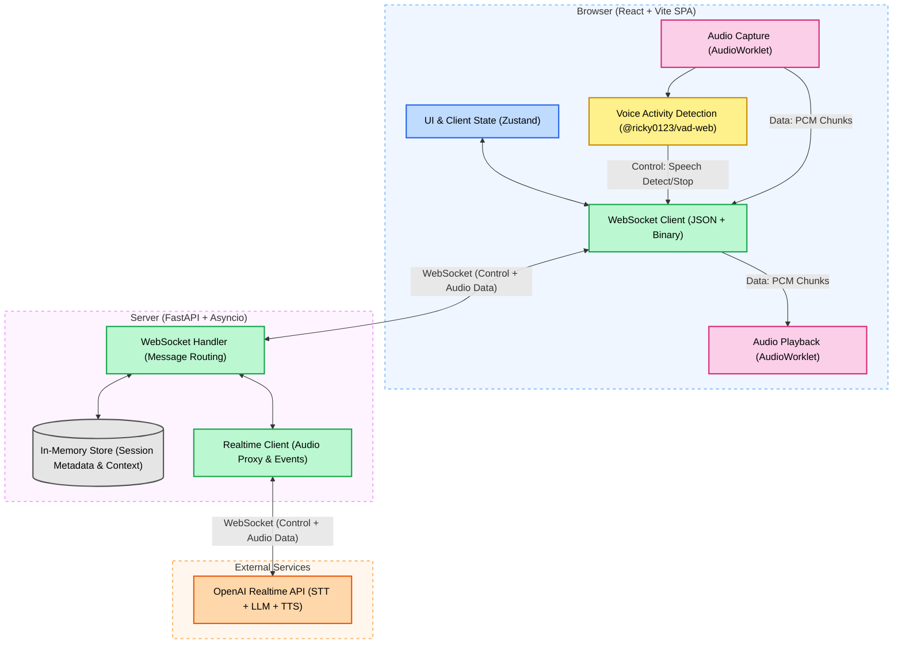

# VeloVoice AI — High-Level Design

> A production-grade, low-latency real-time voice assistant powered by the OpenAI Realtime API.

---

## 1. System Context & Overview

The VeloVoice AI system serves as an interactive voice agent that enables end-to-end conversations with sub-1.2-second latency. It captures voice input from the user via the browser, determines speech activity natively, and proxies the raw audio through a Fast-API driven backend to the OpenAI Realtime API. 

By leveraging an optimistic streaming paradigm, VeloVoice AI streams generated audio back to the user *before* the entirety of the assistant's response is formulated, removing traditional "wait time" processing hurdles.

## 2. High-Level Architecture Diagram

The system employs a client-server proxy model built on WebSockets. Here is the interaction lifecycle from components to external services:

---

## 3. Core Components

### 3.1 Client (Frontend)
- **AudioWorklet Cap/Play**: Emitted and processed directly off the main thread to ensure glitch-free audio processing capabilities. 
- **Voice Activity Detection (VAD)**: A client-side processor preventing server overload. VAD determines exactly when speech begins and terminates through user microphone input, thus instructing the backend `audio.chunk` stream states.
- **WebSocket Streaming**: Responsible for bi-directional communication. Serializes control frames into JSON and routes raw audio over binary payloads.

### 3.2 Server (Backend)
- **WebSocket Route Handler**: Acts as the gatekeeper, managing JSON control validation (pydantic), validating sessions, and determining tool calls asynchronously.
- **In-Memory Store**: Retains connection contexts, metadata, and history via simple dictionary management inside the unified Python process. It is continuously cleaned by an `asyncio` TTL monitor.
- **Realtime Client (Proxy)**: Holds open an upstream WebSocket link to OpenAI, bridging the STT (Speech-to-Text), LLM generation, and TTS (Text-to-Speech) loop as one distinct continuous operation.

### 3.3 External integrations
- **OpenAI Realtime API**: A single endpoint that simultaneously evaluates spoken intent, creates response reasoning, and converts text into spoken language without chaining separate LLM services.

---

## 4. End-to-End Flow (Data Pipeline)

1. **Capture**: Client mic records PCM chunks (16kHz). Voice Activity Detection spots vocal initiation.
2. **Push**: Binary `audio.chunk` frames are transmitted concurrently via WS to the Backend.
3. **Proxy**: The backend `realtime-client.py` transparently cascades the binary buffers into the `api.openai.com/v1/realtime` socket.
4. **Analysis & Synthesis**: OpenAI transcribes the stream and proactively streams back partial JSON text and partial TTS synthesized audio payloads.
5. **Relay & Consume**: Backend pipes TTS payload bytes back to the waiting React app. `audio-playback.ts` schedules the ring buffer for smooth, gapless playback to the user.
